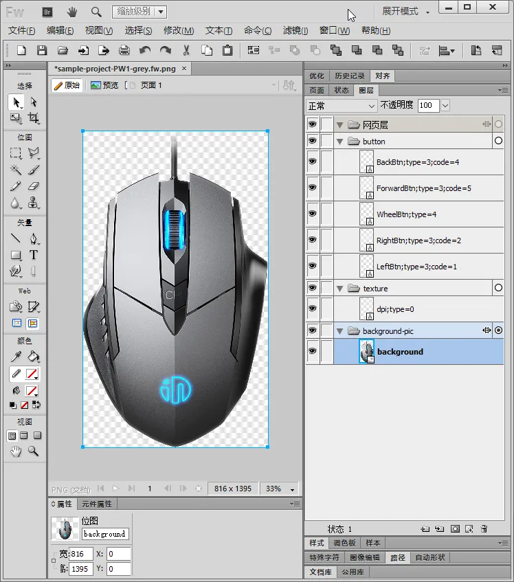
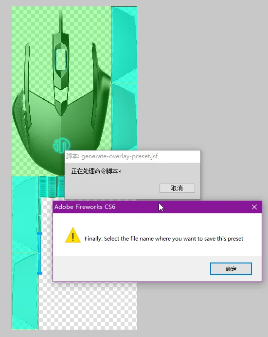
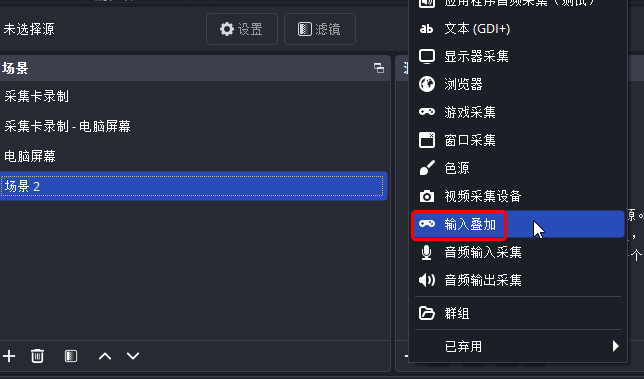
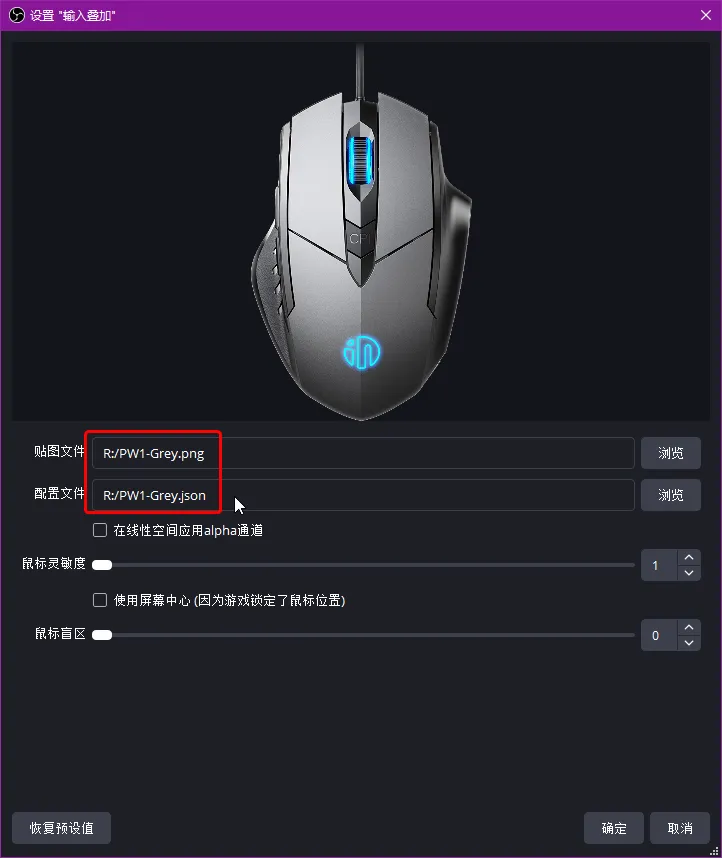
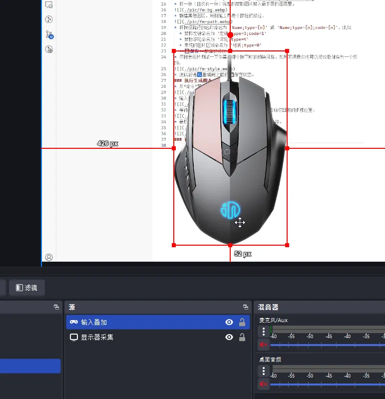

[简体中文说明](README.zh-Hans.md)
# Automatically Generate Presets for OBS-Studio's [Input-Overlay](https://github.com/univrsal/input-overlay) Plugin in Adobe Fireworks  
This script runs in Adobe Fireworks CS6. Currently, it only supports basic mouse elements. By inserting a background image of a mouse in Fireworks and drawing paths for different button areas, it can automatically generate presets for the input-overlay plugin.

Since Fireworks CS6 is a 2012 software (32-bit only) with a JS engine based on ES3 syntax, its scripting API is primarily procedural, making development cumbersome.

A more ideal solution would be using Photoshop v22.0+ with UXP Scripts (V8 engine for modern JS). However, as I'm unfamiliar with PS, this remains a Fireworks project.

## Usage Guide
### Install Script
Place [generate-overlay-preset.jsf](./generate-overlay-preset.jsf) and [es5-polifill-array.js](./es5-polifill-array.js) into either directory below, then restart Fireworks to see them in the Commands menu:
* **User-specific directory** (Enter in File Explorer):  
`%AppData%\Adobe\Fireworks CS6\Commands\`
* **Fireworks install directory** (All users, default):  
`C:\Program Files (x86)\Adobe\Adobe Fireworks CS6\Configuration\Commands\`

### Prepare Fireworks Project
* Refer to [sample-project.fw.png](./sample-project.fw.png)
* Place **one (and only one)** full mouse image in the bottommost layer.  

* Create new layers and draw paths for each button using the Pen Tool.  

* Name button paths as `Name;type=[n]` or `Name;type=[n];code=[n]`, e.g.:  
  * Left mouse button: `Left;type=3;code=1`  
  * Mouse wheel: `Wheel;type=4`  
  * Decorative area: `Texture;type=0`  
* **💾 Save** your project.  
* Test color styles for pressed states. Modify and save as new styles if needed.  
  
* After testing, ↩️ Revert to last saved state.  

### Execute Script
> **High failure rate due to code complexity. Patience required.**  
> If failed, reopen project and retry.  
> Waiting longer between steps improves success rate.  

* Run script from Commands menu:  
  
* Enter your selected style name:  
  
* Wait for 3 execution stages (progress shown in alerts):  
  
* Final save dialog will appear:  
  
  

### Use in OBS-Studio  
* Add "Input Overlay" source to scene:  
  
* Select your generated preset:  
  
* Ready to use in OBS:  
  
