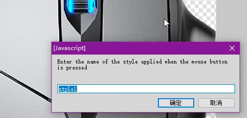

# 在Adobe Fireworks里自动生成 OBS-Studio 的[输入叠加(input-overlay)](https://github.com/univrsal/input-overlay)插件的预设 
本程序在 Adobe Fireworks CS6 下运行，目前只制作了鼠标的基础内容，只要在 Fireworks 里插入鼠标的背景图片，然后绘制不同的按钮区域的路径，就能自动生成 输入叠加(input-overlay)插件的预设。

由于 Fireworks CS6 是 2012 年的软件，只有 32 位，JS 引擎是 ES 3 语法环境，脚本 API 更多是是面向过程开发，编写起来非常的麻烦。

更理想的解决方案是使用 Photoshop v22.0 开使支持的 UXP Scripts，可以使用 V8 引擎书写现代 JS。但是我对 PS 并不熟悉，所以目前仍然是 Fireworks 项目。

## 使用方式介绍
### 安装脚本
将 [generate-overlay-preset.jsf](./generate-overlay-preset.jsf) 和 [es5-polifill-array.js](./es5-polifill-array.js) 文件放入以下两个目录之一，重启 Fireworks 即可显示在命令菜单里。
* 个人数据目录（对当前用户生效），文件管理器地址栏输入：  
`%AppData%\Adobe\Fireworks CS6\Commands\`
* Fireworks 安装目录（对所有用户生效），默认为：  
`C:\Program Files (x86)\Adobe\Adobe Fireworks CS6\Configuration\Commands\`
### 准备 Fireworks 工程
* 请参考 [sample-project.fw.png](./sample-project.fw.png)
* 将一张（且仅有一张）完整的鼠标图片放入最下层的图层里。  

* 新建其他图层，用钢笔工具每个按钮的路径。  

* 将按钮路径的名称命名为 `Name;type=[n]` 或 `Name;type=[n];code=[n]`，比如  
  * 鼠标左键命名为 `左键;type=3;code=1`
  * 鼠标滚轮命名为 `滚轮;type=4`
  * 单纯的图片区域命名为 `材质;type=0`
* **💾保存**前面的修改。
* 用背景图片测试一下你喜欢哪个按下时的颜色风格，如果不满意你也可以修改后储存为一个新的。  
  
* 测试后请↪️撤销到之前的💾保存状态。
### 执行生成脚本
> **由于代码太复杂了，运行过程中失败几率很高，需要耐心测试。**  
> 一旦失败，可以重新打开工程文件再次运行。  
> 每一个步骤都多等几秒钟，成功率会提高。

* 从“命令”菜单启动脚本  

* 输入你之前选择的样式名称  

* 等待 3 段不同的步骤执行，程序将弹出消息框告诉你目前的步骤位置。  

* 最后弹出保存窗口，选择需要保存预设的路径和名称。  
  

### 在 OBS-Studio 中使用
* 在场景中插入“输入叠加”插件  

* 选择刚刚之前的预设  

* 现在你可以在 OBS 内使用了  

